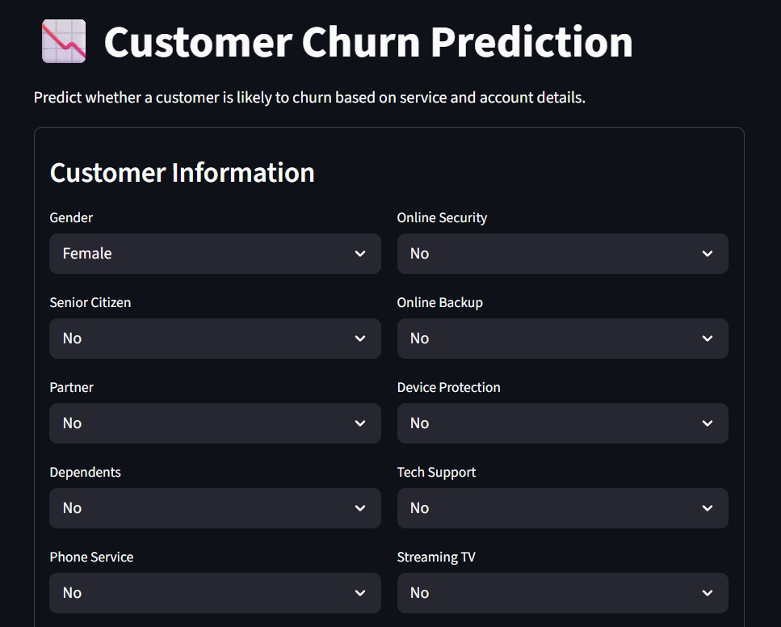
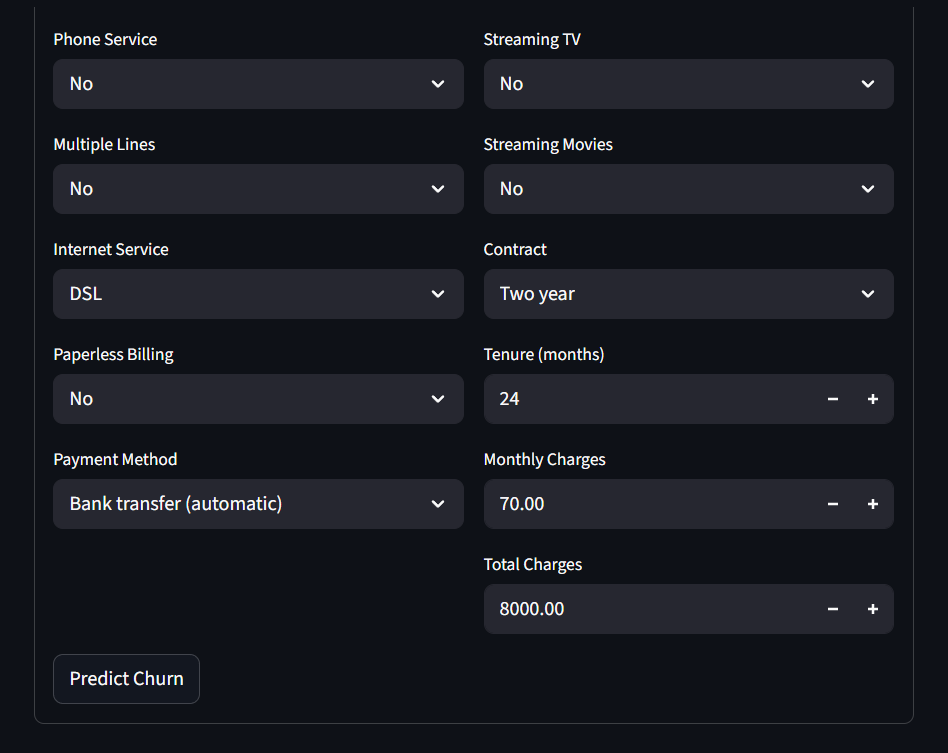
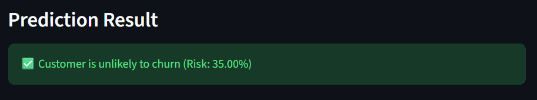

<div align="center">

# 📉 ChurnSense  
### Telecom Customer Retention & Revenue Protection Analytics

An end-to-end machine learning system that predicts telecom customer churn and delivers real-time risk insights through a production-ready Streamlit application.

</div>

---

## 🎯 Why This Project Exists

Customer churn is a major driver of revenue loss in subscription-based businesses.  
Telecom companies require **early, actionable, and explainable churn signals** to proactively retain customers.

**ChurnSense** bridges this gap by combining predictive analytics with a business-friendly decision interface.

---

## 🚀 What This System Does

- 🔍 Predicts churn probability for individual telecom customers  
- 📊 Converts model outputs into **actionable churn risk scores**  
- 🧑‍💼 Enables real-time churn assessment via a lightweight Streamlit app  

---

## 📈 Business Impact (Estimated)

- 💰 **10–15% potential revenue leakage reduction** through targeted retention  
- ⚡ **~40% faster decision turnaround** compared to manual churn analysis  
- 🎯 Improved prioritization for marketing and customer success teams  

> Impact metrics are benchmark-based and aligned with telecom industry standards.

---

## 🧠 System Architecture

```text
Raw Telecom Data
        ↓
Data Cleaning & Feature Engineering
        ↓
Supervised ML Churn Model
        ↓
Serialized Model Artifacts
        ↓
Streamlit Decision Support App
```

---

## 🖥 Application Preview




---

## 📂 Repository Structure
```text
.
├── app.py                           # Streamlit inference application
├── Customer_Churn_Prediction.ipynb  # EDA, feature engineering & modeling
├── customer_churn_model.pkl         # Trained model artifact
├── encoders.pkl                     # Categorical encoders
├── requirements.txt
└── README.md
```

---

## ▶️ Run the Project Locally
```bash
pip install -r requirements.txt
streamlit run app.py
```

---

## 🚀 Conclusion
This project delivers an end-to-end telecom churn prediction solution that transforms customer data into actionable retention insights. By combining machine learning with a business-ready Streamlit application, it enables real-time churn risk assessment and supports proactive, data-driven decision making.

